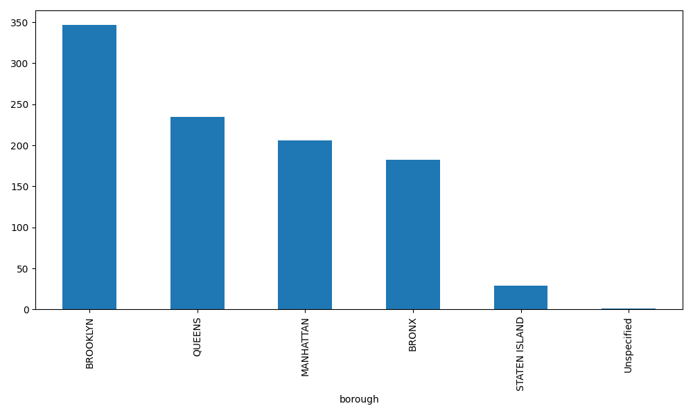
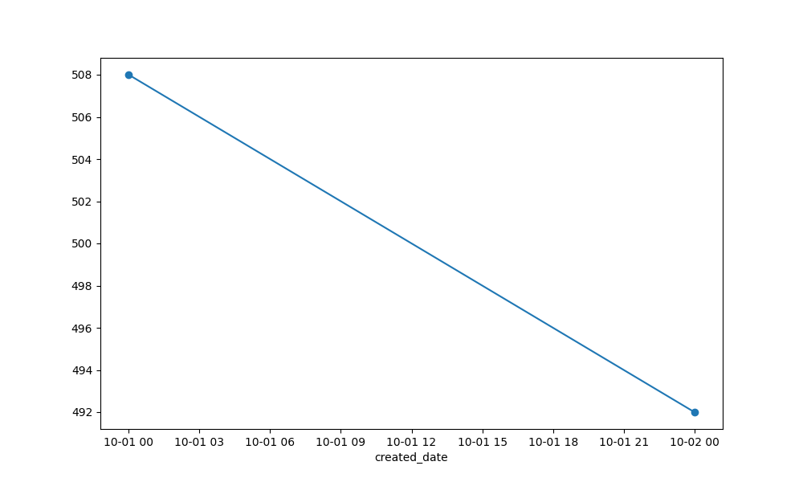

# # NYC 311 Complaint Analysis

## Project Overview

This project analyzes NYC 311 service requests to identify common complaint types and patterns across New York City.

## Data Source

The data comes from the NYC Open Data 311 Service Requests dataset.

## Tools Used

- Python
- Pandas
- Matplotlib
- Seaborn
- Socrata API

## Analysis

This project analyzes:

- Top 10 complaint types
- Complaints by borough
- Complaints over time

## Visualizations

The project includes charts showing:

- NYC 311 complaints by borough
- NYC 311 complaints over time

## Security

The Socrata API token is stored in a `.env` file and is excluded from GitHub using `.gitignore`.

## Visualizations


### Complaints by Borough



### Complaints Over Time



## How to Run

1. Clone this repository.
2. Create a Python virtual environment.
3. Install the required packages.
4. Add your Socrata API token to a `.env` file.
5. Run `analysis.py`.

```bash

python3 [analysis.py](http://analysis.py)
```


## Project Structure

- `analysis.py` — main Python analysis script
- `requirements.txt` — Python packages needed to run the project
- `complaints_by_borough.png` — complaints by borough visualization
- `complaints_over_time.png` — complaints over time visualization
- `.gitignore` — protects local files and secrets

## Key Findings

- Noise — Residential was the most common complaint type, with 263 complaints.

- Illegal Parking was the second most common complaint type, with 184 complaints.

- Brooklyn had the highest number of complaints among the boroughs analyzed, with 347 complaints.

- Queens followed with 235 complaints, while Manhattan had 206.

- Complaints were relatively consistent across the two dates analyzed, with 508 complaints on October 1 and 492 on October 2.